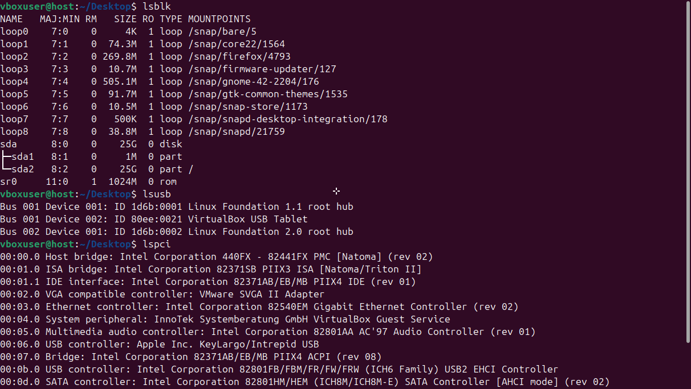
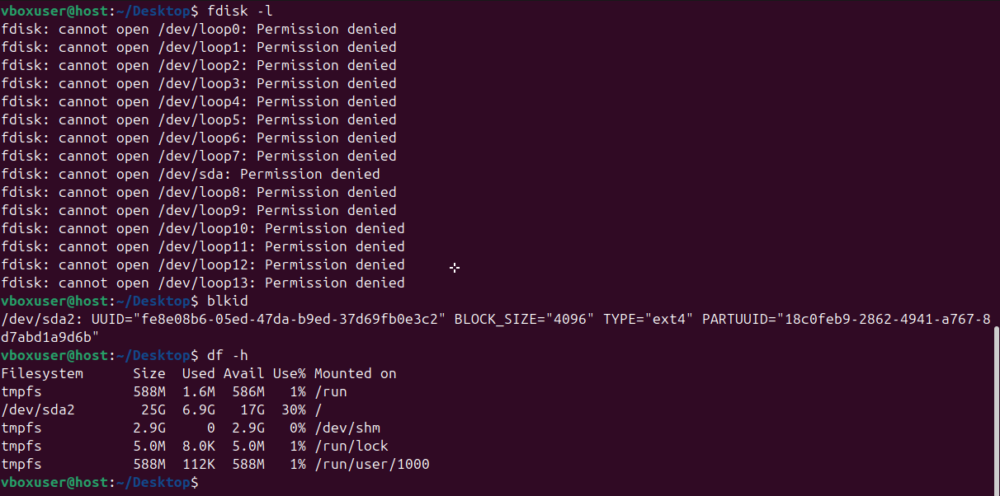
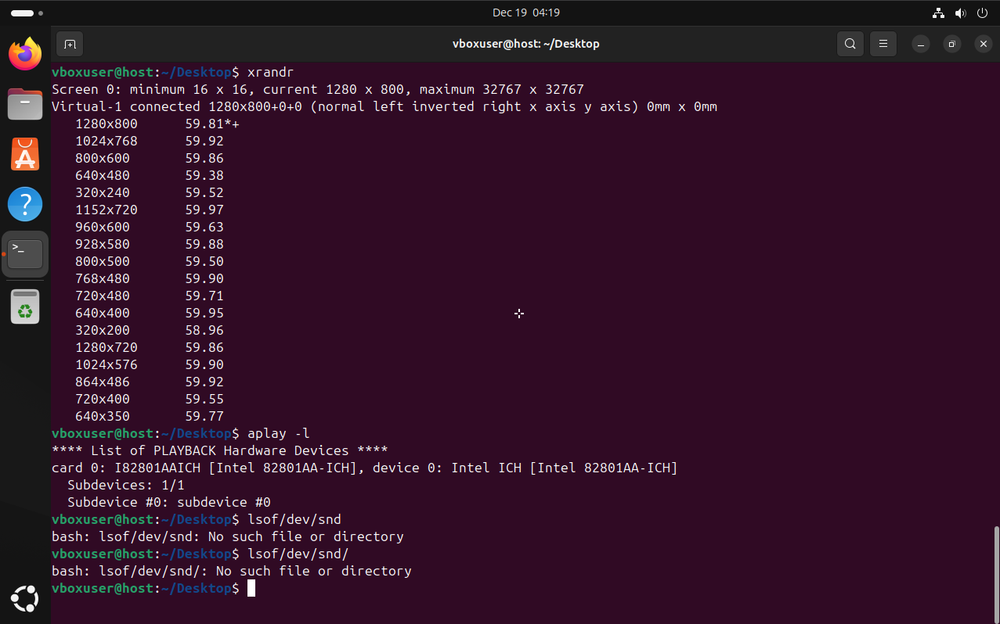

# Administracion de memoria
## 1.Memoria con particiones fijas
### Definición de Estructuras

```c
typedef struct {
    int tamanio;
    int id_particion;
    int id_proceso; // -1 si la partición está libre
} Particion;
```

Define una estructura para representar una partición, que incluye:
- tamanio: El tamaño de la partición.
- id_particion: Identificador único de la partición.
- id_proceso: ID del proceso asignado a la partición o -1 si está libre.

### Funciones Principales

#### Definir Particiones

```c
void definir_particiones(Particion *particiones, int *num_particiones, int tamanio_memoria)
```

Esta función permite definir las particiones en la memoria.
- **Parámetros**:
  - particiones: Array de particiones.
  - num_particiones: Puntero para almacenar el número de particiones definidas.
  - tamanio_memoria: Tamaño total de la memoria disponible.

#### Asignar Proceso

```c
void asignar_proceso(Particion *particiones, int num_particiones, int id_proceso, int tamanio_proceso)
```

Asigna un proceso a la primera partición disponible que cumpla los requisitos de tamaño.
- **Parámetros**:
  - particiones: Array de particiones.
  - num_particiones: Cantidad de particiones.
  - id_proceso: ID del proceso a asignar.
  - tamanio_proceso: Tamaño del proceso.
- **Salida**: Imprime un mensaje indicando si la asignación fue exitosa o fallida.

#### Liberar Proceso

```c
void liberar_proceso(Particion *particiones, int num_particiones, int id_proceso)
```

Libera un proceso de una partición si está asignado.
- **Parámetros**:
  - particiones: Array de particiones.
  - num_particiones: Cantidad de particiones.
  - id_proceso: ID del proceso a liberar.
- **Salida**: Imprime un mensaje confirmando la liberación o informando que el proceso no está asignado.

#### Mostrar Estado

```c
void mostrar_estado(Particion *particiones, int num_particiones)
```

Muestra el estado actual de la memoria.
- **Parámetros**:
  - particiones: Array de particiones.
  - num_particiones: Cantidad de particiones.
- **Salida**: Lista las particiones indicando si están libres o asignadas, junto con los detalles.

### Lógica del Programa Principal

#### Inicio

```c
printf("Simulación de administración de memoria con particiones fijas\n");
```

Imprime un mensaje de bienvenida al usuario indicando el propósito del programa.

```c
scanf("%d", &tamanio_memoria);
```

Solicita al usuario el tamaño total de la memoria y lo almacena en tamanio_memoria.

#### Bucle del Menú

```c
while (true)
```
Inicia un bucle infinito que presenta el menú de opciones al usuario.

```c
int opcion;
scanf("%d", &opcion);
```

Lee la opción seleccionada por el usuario.

#### Opciones del Menú

##### Asignar Proceso

```c
if (opcion == 1)
```

Comprueba si el usuario seleccionó la opción de asignar un proceso. Solicita el ID y tamaño del proceso e intenta asignarlo.

##### Liberar Proceso

```c
else if (opcion == 2)
```

Comprueba si el usuario seleccionó la opción de liberar un proceso. Solicita el ID del proceso e intenta liberarlo.

##### Mostrar Estado

```c
else if (opcion == 3)
```

Muestra el estado actual de la memoria.

##### Salir

```c
else if (opcion == 4)
```

Termina la ejecución del programa con un mensaje de despedida.

#### Finalizar

```c
return 0;
```
Indica el final del programa y devuelve 0 como código de salida exitoso.

# Actividades: Dispositivos de entrada y salida en Linux
## Actividad 1: Listar dispositivos conectados



1. **¿Qué tipos de dispositivos se muestran en la salida de lsblk?**  
   En la salida de lsblk, se muestran dispositivos de bloque, como discos duros (sda), particiones (sda1, sda2) y dispositivos de bucle (loop) que generalmente son utilizados para montar imágenes de sistema o aplicaciones empaquetadas (como Snap). También se incluye un dispositivo de CD-ROM virtual (sr0).

2. **¿Cuál es la diferencia entre lsusb y lspci?**  
   - lsusb: Lista los dispositivos conectados a los puertos USB, como hubs, controladores de USB y dispositivos externos como memorias USB, tablets o webcams.
   - lspci: Enumera los dispositivos conectados al bus PCI, incluyendo hardware interno como controladores gráficos, tarjetas de red, controladores SATA y audio, entre otros.  
   La diferencia principal radica en que lsusb se centra únicamente en dispositivos USB, mientras que lspci muestra todos los dispositivos internos conectados al bus PCI del sistema.

3. **¿Qué información adicional proporciona dmesg | grep usb?**  
   Este comando muestra los mensajes del kernel relacionados específicamente con dispositivos USB. Proporciona información detallada sobre la detección y configuración de dispositivos USB, incluyendo logs de conexión/desconexión, inicialización de controladores y posibles errores. Es útil para diagnosticar problemas o verificar que un dispositivo USB fue reconocido correctamente por el sistema.

## Actividad 2: Verificar dispositivos de almacenamiento



1. **¿Qué dispositivos de almacenamiento están conectados a su sistema?**  
   Según la salida del comando fdisk -l, el sistema tiene un dispositivo principal conectado, identificado como /dev/sda. Este dispositivo incluye varias particiones. Sin embargo, no se pudo acceder directamente a la información detallada debido a la falta de permisos.

2. **¿Qué particiones están montadas actualmente?**  
   Según el comando df -h, la partición montada actualmente es /dev/sda2, que está montada en el directorio raíz (/). Adicionalmente, hay sistemas de archivos temporales (tmpfs) montados para tareas específicas como /run, /dev/shm, y /run/lock.

3. **¿Qué tipo de sistemas de archivos se usan en las particiones?**  
   El comando blkid muestra que la partición /dev/sda2 utiliza el sistema de archivos ext4. Este es un sistema de archivos comúnmente usado en sistemas Linux por su confiabilidad y rendimiento.

## Actividad 3: Explorar dispositivos de entrada

1. **¿Qué eventos genera cada dispositivo al interactuar con ellos?**  
   - **Teclado**: Genera eventos relacionados con pulsaciones de teclas (códigos de teclas presionadas y liberadas). Estos eventos generalmente tienen la etiqueta EV_KEY en la salida de evtest, indicando acciones de entrada a nivel de teclas.
   - **Mouse**: Genera eventos relacionados con movimientos (EV_REL para movimientos relativos), clics de botones (EV_KEY para los botones del ratón) y desplazamiento de la rueda si está disponible (EV_REL con un eje correspondiente).
   - **Controladores USB adicionales**: Los eventos generados dependen del dispositivo conectado. Por ejemplo, un controlador USB puede generar eventos específicos de sus funciones, como EV_ABS para entradas análogas o EV_KEY para botones.

2. **¿Cómo se identifican los dispositivos en /proc/bus/input/devices?**  
   Los dispositivos en este archivo se identifican mediante varias secciones que incluyen:
   - **Name**: El nombre del dispositivo.
   - **Phys**: La ubicación física del dispositivo en el sistema.
   - **Handlers**: Los manejadores asociados al dispositivo (por ejemplo, eventX, donde X es el número del dispositivo para evtest).
   - **Bus**: El tipo de bus al que pertenece el dispositivo (por ejemplo, USB, PCI).

## Actividad 4: Examinar dispositivos de salida



1. **¿Qué salidas de video están disponibles en su sistema?**
   Según la salida del comando xrandr, el sistema tiene conectada una pantalla denominada **Virtual-1** con una resolución actual de **1280x800**. También están disponibles otras resoluciones como **1024x768**, **800x600**, **640x480**, y más, con diferentes frecuencias de actualización.

2. **¿Qué dispositivos de sonido se detectaron?**
   Según la salida del comando aplay -l, se detectó un dispositivo de sonido con los siguientes detalles:

   **Tarjeta de sonido:** Intel ICH [Intel 82801AA-ICH]

   **Dispositivo:** Intel ICH

   **Subdispositivo:** subdevice #0
   

3. **¿Qué procesos están usando la tarjeta de sonido?**
   El comando lsof /dev/snd/* no detectó ningún proceso utilizando la tarjeta de sonido. La salida indica "No such file or directory", lo cual podría significar que el sistema no tiene configurado correctamente el acceso al dispositivo de sonido o que no hay procesos en uso en este momento.