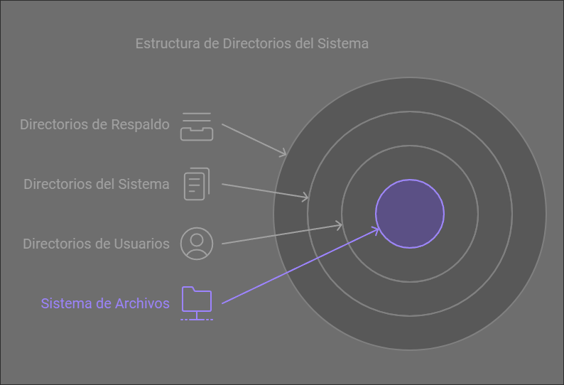

# Sistema de Archivos
## Ejercicio 1: Concepto y Noción de Archivo Real y Virtual

### Concepto de Archivo Real
Un archivo real es una entidad tangible en un sistema de almacenamiento físico, como un disco duro, SSD o unidad externa. Representa datos organizados en bloques o sectores dentro del medio de almacenamiento. Los sistemas operativos interactúan con estos archivos a través de sistemas de archivos (como NTFS, FAT32, EXT4) que permiten su lectura, escritura y administración.

#### Características del Archivo Real:
- **Ubicación física:** Se almacena en una dirección específica dentro del medio de almacenamiento.
- **Gestión directa:** Requiere recursos físicos como espacio en el disco y tiempo de acceso.
- **Ejemplo:** Un documento de texto guardado como reporte.docx en una carpeta de tu computadora.

### Concepto de Archivo Virtual
Un archivo virtual es una representación lógica de datos que no necesariamente están asociados con un medio físico específico en un momento dado. Este tipo de archivo se genera dinámicamente en memoria o se presenta como una abstracción, a menudo gestionada por el sistema operativo o una aplicación.

#### Características del Archivo Virtual:
- **Ubicación lógica:** No reside físicamente en un medio de almacenamiento; su contenido puede ser generado en tiempo real.
- **Gestión flexible:** Puede basarse en recursos temporales, como la RAM o datos de otros sistemas.
- **Ejemplo:** Un archivo que representa datos en la nube o un archivo temporal en memoria, como un archivo de paginación.

### Diferencias entre Archivo Real y Archivo Virtual
| Aspecto              | Archivo Real                       | Archivo Virtual                    |
|----------------------|------------------------------------|------------------------------------|
| **Ubicación**        | Medio físico específico            | Representación lógica              |
| **Acceso**           | A través del sistema de archivos   | Generalmente gestionado en memoria |
| **Persistencia**     | Permanece hasta que se elimina     | Temporal, puede desaparecer tras su uso |
| **Ejemplo**          | Documento en disco                | Archivo temporal en RAM           |

### Ejemplos Prácticos en Sistemas Operativos

#### Manejo de Archivos Reales
- **Windows:** Los documentos almacenados en la carpeta "Documentos" o los archivos del sistema guardados en el disco C:.
- **Linux:** Archivos como /etc/passwd, que contiene información sobre los usuarios del sistema.
- **macOS:** Archivos multimedia en la carpeta "Descargas".

#### Manejo de Archivos Virtuales
- **Windows:** Archivos de paginación (swap) usados para expandir virtualmente la memoria RAM.
- **Linux:** Dispositivos virtuales montados en /dev, como `/dev/null (archivo especial que descarta datos escritos en él).
- **macOS:** La representación de unidades externas antes de que se conecten físicamente.

### Caso Práctico: Utilidad del Archivo Virtual
Un archivo virtual resulta más útil que un archivo real en sistemas que requieren alta velocidad y flexibilidad, como en:

**Sistema Operativo: Linux**
Caso práctico: /proc/cpuinfo
- **Contexto:** /proc/cpuinfo es un archivo virtual que proporciona información del procesador, como el modelo y la frecuencia.
- **Ventaja:** No ocupa espacio físico y siempre muestra datos actualizados del hardware. Esto es fundamental para tareas de monitoreo del sistema en tiempo real, algo que no podría lograrse de manera eficiente con un archivo real.

## Ejercicio 2: Componentes de un Sistema de Archivos

### Introducción
Un sistema de archivos es una estructura lógica que organiza y gestiona cómo se almacenan y recuperan los datos en un medio de almacenamiento. Los componentes principales del sistema de archivos garantizan que los datos sean accesibles de manera eficiente y segura, proporcionando funcionalidad y estructura para las operaciones del sistema operativo.

### Componentes Principales de un Sistema de Archivos

#### 1. **Estructura Jerárquica de Directorios**
La estructura de directorios define cómo se organizan los archivos en el sistema, permitiendo al usuario ubicarlos mediante rutas (absolutas o relativas).
- **Linux:** Utiliza una estructura jerárquica unificada que comienza en el directorio raíz /.
- **Windows:** Cada unidad de almacenamiento tiene su propio sistema de directorios, identificado con una letra, como C:\.

#### 2. **Metadatos**
Son los datos sobre los datos, describiendo atributos como nombre, tamaño, permisos, fecha de creación/modificación, etc.
- **EXT4 (Linux):** Los metadatos están optimizados mediante estructuras como "extents" para minimizar la fragmentación y mejorar el rendimiento.
- **NTFS (Windows):** Usa un archivo especial llamado Master File Table (MFT) que almacena metadatos, permitiendo acceso rápido.

#### 3. **Bloques de Datos**
Los bloques son las unidades mínimas de almacenamiento físico en el disco. Los archivos se dividen en bloques para ser escritos en el disco.
- **Linux (EXT4):** Los bloques pueden tener tamaños configurables (1 KB, 2 KB, 4 KB), mejorando la compatibilidad según el uso del sistema.
- **Windows (NTFS):** Maneja clústeres (agrupaciones de bloques) para mejorar la gestión del espacio.

#### 4. **Tablas de Asignación de Archivos**
Estas tablas rastrean qué bloques están ocupados y qué bloques están disponibles en el sistema de almacenamiento.
- **EXT4:** Usa un sistema de asignación basado en mapas de bits y bloques de grupo, optimizando la velocidad de localización.
- **NTFS:** Implementa una estructura más avanzada con índices B+ que reducen la latencia de búsqueda.

#### 5. **Journaling (Registro de Cambios)**
Es una característica de los sistemas de archivos modernos que asegura la consistencia del sistema tras errores o fallos, registrando operaciones antes de realizarlas.
- **EXT4:** Implementa journaling para metadatos y, opcionalmente, para datos completos.
- **NTFS:** Usa journaling a través del archivo $LogFile, proporcionando robustez ante fallos.

#### 6. **Permisos y Seguridad**
Los sistemas de archivos deben gestionar los accesos según permisos asignados a usuarios y grupos.
- **EXT4:** Basado en el modelo de permisos POSIX (lectura, escritura, ejecución).
- **NTFS:** Incluye un sistema avanzado de control de acceso mediante listas de control de acceso (ACLs).

---

### Cuadro Comparativo: EXT4 vs. NTFS

| Componente               | **EXT4 (Linux)**                                                              | **NTFS (Windows)**                                                             |
|--------------------------|------------------------------------------------------------------------------|-------------------------------------------------------------------------------|
| **Estructura Jerárquica** | Directorio unificado desde /                                              | Directorios separados para cada unidad (e.g., C:\, D:\)                  |
| **Metadatos**            | Guardados en estructuras eficientes (como extents).                        | Manejados por la `MFT, almacenando todos los metadatos en un solo lugar.    |
| **Tamaño de Bloque**      | Configurable (1 KB, 2 KB, 4 KB).                                            | Usa clústeres dinámicos dependiendo del tamaño del disco.                    |
| **Asignación de Archivos**| Mapas de bits y bloques de grupo.                                           | Índices B+ y MFT para búsquedas más rápidas.                                 |
| **Journaling**            | Opcional, optimizado para metadatos.                                        | Siempre activo, garantizando alta integridad mediante $LogFile.            |
| **Permisos**              | Basados en POSIX; simples y efectivos.                                     | Basados en ACLs, ofreciendo controles más detallados.                        |
| **Compatibilidad**        | Limitado a sistemas Linux y algunos controladores en Windows.              | Compatible con casi todas las versiones de Windows.                          |
| **Fragmentación**         | Baja debido a extents.                                                     | Puede fragmentarse más fácilmente, aunque incluye un desfragmentador.        |

### Ventajas y Desventajas

#### Ventajas de EXT4
1. **Rendimiento Optimizado:** Ideal para sistemas Linux con uso intensivo de lectura/escritura.
2. **Fragmentación Baja:** El uso de extents minimiza la fragmentación, mejorando el rendimiento general.
3. **Journaling Opcional:** Permite mayor personalización según las necesidades del usuario.
4. **Eficiencia en Almacenamiento:** Los bloques configurables permiten optimizar el espacio según el tamaño del archivo.

#### Desventajas de EXT4
1. **Compatibilidad Limitada:** No es nativamente compatible con Windows.
2. **Falta de Soporte Avanzado:** Funciones como ACLs avanzadas son más limitadas.

#### Ventajas de NTFS
1. **Amplia Compatibilidad:** Usado en todos los sistemas Windows, con soporte también en Linux mediante controladores.
2. **Seguridad Robusta:** ACLs permiten un control detallado sobre quién puede acceder a qué.
3. **Journaling Permanente:** Protege los datos contra fallos inesperados del sistema.

#### Desventajas de NTFS
1. **Mayor Fragmentación:** Aunque incluye un desfragmentador, su diseño puede llevar a más fragmentación que EXT4.
2. **Sobrecarga de Recursos:** El sistema de journaling constante consume más recursos.

### Ejemplo de Casos de Uso

#### Cuando Usar EXT4:
- **Servidores Linux:** Su baja fragmentación y alto rendimiento lo hacen ideal para servidores que manejan grandes volúmenes de datos.
- **Dispositivos Integrados:** Debido a su configuración personalizable, es adecuado para sistemas con almacenamiento limitado.

#### Cuando Usar NTFS:
- **Sistemas Windows:** Su integración nativa garantiza un rendimiento óptimo en dispositivos Windows.
- **Entornos Mixtos:** Es ideal si necesitas compartir datos entre Windows y Linux.

## Ejercicio 3: Organización Lógica y Física de Archivos

### Organización Lógica: Árbol Jerárquico de Directorios
En la mayoría de los sistemas de archivos, los archivos y directorios están organizados de forma lógica en una estructura jerárquica similar a un árbol. 

#### Ejemplo de Árbol Jerárquico


#### Explicación:
1. **Raíz (/):** Es el directorio base del sistema.
2. **Directorios Secundarios:** Contienen subdirectorios y archivos. Por ejemplo, /home/usuario/documentos/ contiene archivos como proyecto.md y informe.pdf.
3. **Archivos:** Son las hojas del árbol, mientras que los directorios son los nodos.

### Organización Física: Traducción de Dirección Lógica a Dirección Física
En el nivel físico, los datos no están organizados jerárquicamente como en el nivel lógico. En su lugar, están almacenados como bloques distribuidos en el disco. La traducción entre la organización lógica y física se realiza mediante el sistema de archivos.

#### Proceso de Traducción
1. **Nombre del Archivo (Lógico):** Cuando un usuario solicita abrir un archivo, proporciona su ruta lógica, como /home/usuario/documentos/proyecto.md.
2. **Sistema de Archivos:** El sistema convierte esta ruta en un identificador único llamado **inode** (en sistemas Linux) o una entrada en la **MFT** (en sistemas NTFS).
3. **Bloques Físicos:** El inode o la MFT contiene información sobre los bloques físicos donde está almacenado el archivo.
4. **Lectura Física:** El sistema accede a esos bloques físicos, los carga en memoria y los presenta al usuario.

#### Relación entre Estructuras
| **Estructura Lógica** | **Estructura Física** |
|-----------------------|-----------------------|
| Directorios           | Entradas en tablas de asignación. |
| Archivos              | Bloques de datos distribuidos en el disco. |
| Metadatos             | Inodes, MFT o estructuras similares. |

### Ejemplo Práctico de Almacenamiento Físico
Supongamos que tenemos el archivo proyecto.md de 8 KB almacenado en un disco con bloques de 4 KB.

#### Detalles:
- **Archivo Lógico:** /home/usuario/documentos/proyecto.md.
- **Bloques Físicos:** El archivo ocupa dos bloques (Bloque 5 y Bloque 10).

#### Paso a Paso:
1. **Ubicación Lógica:** El archivo está en la ruta /home/usuario/documentos/.
2. **Sistema de Archivos:**
   - Crea una entrada en el inode o la MFT que asocia el archivo con los bloques físicos.
   - Guarda los metadatos, como permisos, tamaño, y ubicaciones de bloques.
3. **Ubicación Física:**
   - Bloque 5: Contiene los primeros 4 KB del archivo.
   - Bloque 10: Contiene los últimos 4 KB del archivo.

#### Representación Gráfica
```plaintext
[Archivo Lógico]
proyecto.md --> Inode #25 --> [Bloque 5] [Bloque 10]

[Disco Físico]
Bloque 1  | Metadata de /home
Bloque 2  | Metadata de /usuario
Bloque 3  | Metadata de /documentos
Bloque 4  | Metadata de proyecto.md (Inode #25)
Bloque 5  | Contenido de proyecto.md (Primera parte)
Bloque 10 | Contenido de proyecto.md (Segunda parte)
```

## Ejercicio 4: Mecanismos de Acceso a los Archivos

### Definición de los Mecanismos de Acceso

1. **Acceso Secuencial:**
   - Los datos se leen o escriben de forma ordenada, uno tras otro, desde el inicio del archivo hasta el final.
   - Es ideal para procesar grandes volúmenes de datos lineales, como registros en un log.
   - **Ejemplo:** Leer todas las líneas de un archivo de texto en orden.

2. **Acceso Directo (o Aleatorio):**
   - Permite acceder directamente a una posición específica en el archivo sin necesidad de leer desde el principio.
   - Se utiliza cuando se conoce la posición exacta de los datos dentro del archivo.
   - **Ejemplo:** Buscar un registro específico en un archivo binario.

3. **Acceso Indexado:**
   - Utiliza una estructura adicional (índice) para localizar rápidamente las posiciones de los datos en el archivo.
   - Es útil en sistemas donde se realizan búsquedas frecuentes de datos específicos.
   - **Ejemplo:** Una base de datos con índices para acceder a registros por clave primaria.

### Pseudocódigos para los Mecanismos de Acceso

#### 1. Acceso Secuencial
```plaintext
# Pseudocódigo para leer un archivo secuencialmente
Abrir archivo en modo lectura
Mientras no se alcance el final del archivo:
    Leer línea actual
    Procesar línea
Cerrar archivo
```

**Ejemplo Práctico:**
```python
# Python - Leer un archivo secuencialmente
with open("datos.txt", "r") as archivo:
    for linea in archivo:
        print(linea.strip())
```

#### 2. Acceso Directo
```plaintext
# Pseudocódigo para acceso directo por posición
Abrir archivo en modo lectura
Ir a la posición deseada en el archivo
Leer datos desde esa posición
Procesar los datos
Cerrar archivo
```

**Ejemplo Práctico:**
```python
with open("datos.bin", "rb") as archivo:
    archivo.seek(20)  # Ir a la posición 20 (offset)
    datos = archivo.read(10)  # Leer 10 bytes desde esa posición
    print(datos)
```

#### 3. Acceso Indexado
```plaintext
# Pseudocódigo para acceso indexado
Cargar índice en memoria
Buscar en el índice la posición asociada al dato deseado
Abrir archivo en modo lectura
Ir a la posición indicada por el índice
Leer y procesar los datos
Cerrar archivo
```

**Ejemplo Práctico:**
```python
# Simular acceso indexado
indice = {"registro1": 0, "registro2": 50, "registro3": 100}  # Índice en memoria
registro_buscado = "registro2"

with open("datos.bin", "rb") as archivo:
    posicion = indice[registro_buscado]
    archivo.seek(posicion)  # Ir a la posición indicada
    datos = archivo.read(10)  # Leer 10 bytes
    print(datos)
```

### Comparación de los Mecanismos de Acceso

| **Aspecto**          | **Acceso Secuencial**                     | **Acceso Directo**                       | **Acceso Indexado**                     |
|----------------------|------------------------------------------|-----------------------------------------|-----------------------------------------|
| **Velocidad**        | Lento para registros específicos         | Rápido si se conoce la posición         | Muy rápido con un índice bien diseñado  |
| **Facilidad de Uso** | Simple de implementar                   | Requiere conocimiento del offset        | Más complejo por la gestión del índice  |
| **Espacio Adicional**| No requiere espacio extra               | No requiere espacio extra               | Requiere almacenamiento para el índice  |
| **Caso de Uso**      | Procesamiento completo de datos (logs)  | Lectura de datos específicos (binarios) | Bases de datos o búsquedas frecuentes   |

### Ejemplos de Casos de Uso

1. **Acceso Secuencial:**
   - Procesar registros en un archivo de log para análisis de eventos.
   - Leer un archivo CSV línea por línea.

2. **Acceso Directo:**
   - Recuperar un registro específico en un archivo binario grande.
   - Editar un archivo de configuración en una posición específica.

3. **Acceso Indexado:**
   - Consultar datos en una base de datos relacional.
   - Buscar una palabra en un índice invertido en motores de búsqueda.

Aquí tienes el desarrollo detallado del **Ejercicio 5: Modelo jerárquico y mecanismos de recuperación en caso de falla**.

## Ejercicio 5: Modelo Jerárquico y Mecanismos de Recuperación en Caso de Falla

### Modelo Jerárquico para un Sistema de Archivos

El sistema está diseñado con tres niveles principales:



#### Descripción:
1. **Raíz (/)**: Directorio principal que contiene subdirectorios importantes.
2. **Usuarios (/usuarios/)**: Contiene datos personales organizados por usuario.
3. **Sistema (/sistema/)**: Contiene logs y configuraciones del sistema operativo.
4. **Respaldos (/respaldos/)**: Almacena copias de seguridad de directorios críticos.

### Simulación de una Falla

#### Escenario:
El directorio /usuarios/axel/documentos/ es dañado debido a un fallo del sistema de archivos. Los archivos almacenados dentro (e.g., proyecto1.md e informe_final.pdf) ya no están accesibles.

#### Pasos para la Recuperación

1. **Verificación Inicial:**
   - Usar una herramienta como fsck (en Linux) o chkdsk (en Windows) para verificar y reparar errores en el sistema de archivos:
     ```bash
     fsck /dev/sdX
     ```
     Esto busca corregir errores menores como referencias corruptas.

2. **Recuperación de Directorios Perdidos:**
   - Si el sistema de archivos tiene un espacio reservado para archivos huérfanos, buscar allí:
     ```bash
     ls -l /lost+found/
     ```
   - Mover los archivos recuperados a su ubicación original.

3. **Uso de Copias de Seguridad:**
   - Restaurar el directorio desde la última copia de seguridad almacenada en /respaldos/usuarios_axel/:
     ```bash
     cp -r /respaldos/usuarios_axel/documentos/ /usuarios/axel/
     ```

4. **Recuperación con Herramientas Especializadas:**
   - Si los pasos anteriores fallan, emplear herramientas de recuperación de datos como:
     - **TestDisk**: Para reconstruir estructuras de partición.
     - **Photorec**: Para recuperar archivos específicos.

### Técnicas y Herramientas de Respaldo

#### 1. Copias de Seguridad Programadas
- **Herramientas:** 
  - **rsync (Linux):** Sincroniza directorios y realiza copias incrementales.
    ```bash
    rsync -av --delete /usuarios/ /respaldos/usuarios/
    ```
  - **Backup and Restore (Windows):** Proporciona copias programadas y restauración fácil.
- **Frecuencia:** 
  - Realizar respaldos diarios para directorios críticos como /usuarios/.

#### 2. Sistemas de Versionado
- Implementar sistemas como **Git** para archivos que requieren un historial de cambios, como documentos de texto o proyectos.
  ```bash
  git init
  git add proyecto1.md
  git commit -m "Primer respaldo"
  ```

#### 3. Snapshots
- Utilizar sistemas de archivos como ZFS o Btrfs que permiten tomar snapshots del sistema:
  ```bash
  zfs snapshot pool1@snapshot1
  ```

#### 4. Almacenamiento en la Nube
- **Servicios:** Google Drive, OneDrive, o soluciones empresariales como AWS S3.
- **Ventaja:** Ofrecen respaldo en ubicaciones geográficamente distintas, minimizando riesgos por desastres físicos.

### Comparación de Técnicas de Respaldo

| **Método**                | **Ventajas**                                      | **Desventajas**                                  |
|---------------------------|--------------------------------------------------|-------------------------------------------------|
| **Copias de Seguridad**   | Simples, automatizables, y económicas            | Requieren espacio físico para almacenamiento    |
| **Versionado**            | Control de cambios, útil para desarrollo         | No adecuado para grandes volúmenes de datos     |
| **Snapshots**             | Recuperación rápida de estados previos           | Compatible solo con sistemas específicos        |
| **Almacenamiento en la Nube** | Respaldo remoto, accesible desde cualquier lugar | Requiere conexión constante y suscripción       |

# Protección y Seguridad

## Ejercicio 1: Concepto y objetivos de protección y seguridad

### **Conceptos de Protección y Seguridad en Sistemas Operativos**

En el ámbito de los sistemas operativos, los conceptos de **protección** y **seguridad** desempeñan un papel clave para garantizar un entorno funcional y confiable:

- **Protección**: Se refiere a los mecanismos diseñados para controlar el acceso a los recursos del sistema, como la memoria, los archivos y los dispositivos. Su propósito principal es evitar usos indebidos o accesos no autorizados, garantizando que solo las entidades legítimas puedan interactuar con los recursos.

- **Seguridad**: Se enfoca en proteger el sistema contra amenazas externas e internas que puedan comprometer su funcionalidad. Abarca medidas para salvaguardar la **confidencialidad**, **integridad** y **disponibilidad** de los datos, así como herramientas para la detección y respuesta ante incidentes.

Ambos conceptos son fundamentales para prevenir accesos no autorizados, errores accidentales y ataques maliciosos.

### **Objetivos Principales de un Sistema de Protección y Seguridad**

Los sistemas operativos implementan mecanismos de protección y seguridad con los siguientes objetivos principales:

#### 1. **Confidencialidad**
Garantiza que la información sensible solo sea accesible para usuarios o procesos autorizados. Esto se logra a través de:
- Controles de acceso (autenticación y autorización).
- Encriptación de datos para proteger la información durante su almacenamiento y transmisión.

#### 2. **Integridad**
Asegura que los datos y recursos del sistema no sean alterados de manera no autorizada. Las medidas más comunes incluyen:
- Hashes y sumas de verificación para detectar modificaciones.
- Mecanismos de control de versiones para proteger los datos contra errores accidentales.

#### 3. **Disponibilidad**
Se enfoca en mantener los recursos y servicios operativos para los usuarios legítimos, incluso bajo ataques o fallos. Algunas prácticas incluyen:
- Planes de recuperación ante desastres.
- Sistemas de respaldo.
- Prevención de ataques de denegación de servicio (DoS).

#### 4. **Autenticidad**
Verifica que los usuarios o sistemas sean quienes afirman ser. Esto previene suplantaciones mediante:
- Métodos de autenticación como contraseñas, biometría o certificados digitales.

#### 5. **No Repudio**
Impide que una entidad niegue haber realizado una acción específica. Este objetivo es esencial en:
- Transacciones electrónicas con firmas digitales.
- Registros detallados en auditorías.

### **Ejemplo Práctico**

#### Contexto:
Imaginemos un sistema operativo en una empresa que maneja información financiera confidencial.

1. **Confidencialidad**: Los archivos de datos financieros están cifrados. Solo los empleados del área contable tienen acceso a través de credenciales únicas, y se implementan políticas que limitan la visibilidad de los datos.

2. **Integridad**: Cada archivo tiene un hash asociado que se verifica antes y después de cualquier modificación. Si el hash no coincide, el sistema genera una alerta.

3. **Disponibilidad**: El sistema realiza respaldos diarios y cuenta con servidores redundantes para evitar interrupciones en caso de fallos o ataques.

4. **Autenticidad**: Los empleados acceden al sistema mediante tarjetas inteligentes y autenticación multifactor, asegurando que solo personal autorizado ingrese.

5. **No Repudio**: Cada operación financiera requiere una firma digital que registra de manera inequívoca al empleado que realizó la transacción.

## Ejercicio 2: Clasificación aplicada a la seguridad

La seguridad en sistemas operativos es un aspecto fundamental para garantizar el correcto funcionamiento de los recursos, proteger la información y prevenir accesos no autorizados o ataques maliciosos. Para abordar estos desafíos, los mecanismos de seguridad se clasifican comúnmente en **seguridad física**, **seguridad lógica** y **seguridad de red**. A continuación, exploraremos cada una de estas clasificaciones, explicando su rol, importancia y ejemplos de herramientas y técnicas utilizadas.

### 1. Seguridad Física  

#### **Descripción**
La **seguridad física** se centra en proteger el **hardware** y otros componentes físicos del sistema informático frente a daños accidentales, accesos no autorizados, robos o desastres naturales. Aunque puede parecer menos relevante que otros niveles de seguridad, la protección física es crucial porque sin un hardware funcional, el software y los datos no pueden operar.

#### **Rol en la Protección del Sistema Operativo**
La seguridad física contribuye a proteger la **disponibilidad** del sistema. Un sistema operativo no puede funcionar si el hardware o infraestructura donde reside se ve comprometido. Si un atacante obtiene acceso físico a los dispositivos, podría:
- Robar discos duros o servidores.
- Instalar hardware malicioso, como dispositivos **keyloggers**.
- Manipular los sistemas para obtener acceso a datos o ejecutar ataques.  

#### **Técnicas y Ejemplos Prácticos**
1. **Controles de Acceso Físico**:  
   - **Tarjetas de acceso electrónico**: Permiten restringir la entrada a salas de servidores o áreas de datos a personal autorizado.  
   - **Biometría**: Utilización de huellas digitales, reconocimiento facial o escaneo de retina.  
   - **Guardias de Seguridad**: Personal entrenado que vigila áreas sensibles.  

2. **Monitoreo y Vigilancia**:  
   - **Cámaras de seguridad (CCTV)**: Se colocan en puntos críticos para monitorear y registrar actividades.  
   - **Alarmas y sensores de movimiento**: Detectan accesos no autorizados.  

3. **Protección contra Desastres Naturales**:  
   - **Sistemas contra incendios**: Detectores de humo y rociadores automáticos.  
   - **Centros de datos redundantes**: Provisión de copias de seguridad físicas en ubicaciones separadas.  
   - **Baterías de respaldo (UPS)** y **generadores**: Aseguran la disponibilidad eléctrica constante.  

4. **Protección de Dispositivos**:  
   - **Bloqueos físicos en puertos USB**: Evitan la conexión de dispositivos no autorizados.  
   - **Armarios seguros para servidores**: Gabinetes con cerraduras electrónicas.  

#### **Ejemplo Práctico**  
En una gran empresa, el centro de datos se encuentra dentro de una habitación restringida. Solo el personal autorizado accede mediante **tarjetas de acceso** y **escaneo biométrico**. Cámaras CCTV monitorean las actividades las 24 horas, y hay sistemas de refrigeración y protección contra incendios para evitar daños físicos.

### 2. Seguridad Lógica  

#### **Descripción**
La **seguridad lógica** se enfoca en proteger los recursos de software y datos de accesos no autorizados, modificaciones, errores o ataques informáticos. Incluye mecanismos como **autenticación**, **autorización** y **control de acceso**, así como herramientas para prevenir y detectar actividades maliciosas.  

#### **Rol en la Protección del Sistema Operativo**
La seguridad lógica garantiza la **confidencialidad**, **integridad** y **autenticidad** de los datos y recursos en el sistema operativo. Sin estas medidas, el sistema queda vulnerable a:
- Ataques de malware y virus.
- Accesos no autorizados a archivos o procesos.
- Daños intencionados al software crítico.  

#### **Técnicas y Ejemplos Prácticos**
1. **Autenticación y Autorización**:  
   - **Contraseñas seguras**: Implementación de políticas robustas de contraseñas.  
   - **Autenticación Multifactor (MFA)**: Verificación mediante múltiples factores, como contraseñas y tokens SMS.  

2. **Protección contra Malware**:  
   - **Antivirus**: Software que detecta y elimina virus y malware. Ejemplo: **Windows Defender, Kaspersky**.  
   - **Anti-ransomware**: Herramientas específicas para evitar secuestros de datos.  

3. **Control de Acceso**:  
   - **Permisos de archivos**: Sistemas de control de lectura, escritura y ejecución de archivos.  
   - **Listas de Control de Acceso (ACL)**: Especifican qué usuarios o procesos pueden acceder a recursos específicos.  

4. **Cifrado de Información**:  
   - **Cifrado de archivos**: Herramientas como BitLocker en Windows protegen los archivos del disco duro.  
   - **Cifrado en tránsito**: Uso de protocolos como **SSL/TLS** para proteger datos enviados por red.  

5. **Monitoreo y Auditoría**:  
   - **Registros de actividades (logs)**: Mantienen un historial de eventos para auditar accesos y errores.  

#### **Ejemplo Práctico**  
Un sistema operativo como **Windows Server** utiliza **contraseñas robustas** y **permisos de archivos** para garantizar que solo administradores puedan modificar configuraciones críticas. Además, utiliza **BitLocker** para cifrar los discos duros y proteger la información en caso de robo.

#### 3. Seguridad de Red  

#### **Descripción**
La **seguridad de red** protege las comunicaciones y datos que viajan entre sistemas conectados. Se enfoca en prevenir **interceptación de datos**, **ataques de denegación de servicio (DoS)**, y **accesos no autorizados** a través de redes públicas o privadas.  

#### **Rol en la Protección del Sistema Operativo**
La seguridad de red garantiza la **confidencialidad** y **disponibilidad** de los datos mientras se transmiten. Sin estas medidas, los atacantes podrían:
- Interceptar información confidencial (ataques de "man-in-the-middle").  
- Saturar la red para hacerla inaccesible.  
- Acceder remotamente a sistemas no protegidos.  

#### **Técnicas y Ejemplos Prácticos**
1. **Firewalls**:  
   - **Firewalls de software**: Ejemplo: **Windows Firewall**.  
   - **Firewalls de hardware**: Dispositivos que filtran el tráfico a nivel de red.  

2. **Redes Privadas Virtuales (VPN)**:  
   - Protegen la información transmitida a través de redes públicas mediante cifrado.  

3. **Sistemas de Detección y Prevención de Intrusos (IDPS)**:  
   - Detectan actividades sospechosas y bloquean ataques automáticamente.  

4. **Segmentación de Red**:  
   - Divide la red en subredes para limitar el alcance de posibles ataques.  

5. **Control de Acceso a la Red (NAC)**:  
   - Asegura que solo dispositivos autorizados puedan conectarse a la red.  

#### **Ejemplo Práctico**  
En una empresa, el acceso a la red está protegido con un **firewall** y **VPN**. Los empleados utilizan credenciales únicas para acceder remotamente a los recursos, y se implementa un **IDPS** que bloquea intentos de intrusión sospechosos.

## Ejercicio 3: Funciones del sistema de protección

En un entorno multiusuario, donde múltiples individuos acceden y utilizan los recursos de un sistema simultáneamente, es esencial implementar un sistema de protección robusto. Este sistema garantiza que cada usuario interactúe únicamente con los recursos para los cuales tiene permiso, manteniendo la integridad, confidencialidad y disponibilidad de la información. A continuación, se detallan las funciones clave de un sistema de protección: **control de acceso**, **autenticación**, **autorización** y **auditoría**.

### Control de Acceso a los Recursos

#### Descripción

El **control de acceso** es el mecanismo que determina quién puede interactuar con qué recursos dentro del sistema. En un entorno multiusuario, es fundamental para prevenir accesos no autorizados y asegurar que los usuarios solo realicen acciones permitidas.

#### Implementación

- **Listas de Control de Acceso (ACL)**: Definen permisos específicos para usuarios o grupos sobre archivos y directorios. Por ejemplo, en sistemas UNIX/Linux, las ACL permiten asignar permisos detallados más allá de los tradicionales permisos de propietario, grupo y otros. :contentReference[oaicite:0]{index=0}

- **Modelos de Control de Acceso**:
  - **Control de Acceso Discrecional (DAC)**: El propietario de un recurso decide quién puede acceder y con qué permisos. Este modelo es común en sistemas operativos como Windows y UNIX. :contentReference[oaicite:1]{index=1}
  - **Control de Acceso Obligatorio (MAC)**: Las políticas de acceso son establecidas por una autoridad central, y los usuarios no pueden cambiarlas.
  - **Control de Acceso Basado en Roles (RBAC)**: Los permisos se asignan según roles específicos dentro de la organización, facilitando la gestión en entornos con muchos usuarios.

#### Importancia

Un control de acceso efectivo previene que usuarios no autorizados accedan a información sensible, reduciendo riesgos de violaciones de seguridad y garantizando que cada usuario tenga acceso únicamente a los recursos necesarios para sus funciones.

### Autenticación

#### Descripción

La **autenticación** es el proceso de verificar la identidad de un usuario que intenta acceder al sistema. Asegura que quien solicita acceso es realmente quien dice ser.

#### Métodos Comunes

- **Contraseñas**: La forma más tradicional, donde el usuario proporciona una clave secreta.
- **Autenticación Multifactor (MFA)**: Combina múltiples métodos, como algo que el usuario sabe (contraseña), algo que tiene (token) y algo que es (biometría), para una verificación más robusta. :contentReference[oaicite:2]{index=2}
- **Biometría**: Utiliza características físicas del usuario, como huellas dactilares o reconocimiento facial.

#### Importancia

La autenticación garantiza que solo usuarios legítimos accedan al sistema, siendo la primera línea de defensa contra accesos no autorizados.

### Autorización

#### Descripción

La **autorización** determina los niveles de acceso y las acciones que un usuario autenticado puede realizar dentro del sistema. Mientras que la autenticación verifica la identidad, la autorización define los permisos asociados a esa identidad.

#### Implementación

- **Políticas de Seguridad**: Definen qué recursos son accesibles para diferentes usuarios o roles.
- **Roles y Permisos**: Asignación de permisos específicos según el rol del usuario en la organización, facilitando la gestión de acceso.

#### Importancia

La autorización asegura que los usuarios solo puedan acceder y manipular los recursos para los cuales tienen permiso, protegiendo la integridad y confidencialidad de la información.

### Auditoría

#### Descripción

La **auditoría** implica el registro y análisis de las actividades realizadas por los usuarios dentro del sistema. Permite monitorear el uso de los recursos y detectar comportamientos inusuales o no autorizados.

#### Implementación

- **Registros de Eventos (Logs)**: Almacenan información sobre accesos, modificaciones y otras actividades relevantes.
- **Sistemas de Detección de Intrusos (IDS)**: Monitorean el sistema en tiempo real para identificar actividades sospechosas.

#### Importancia

La auditoría facilita la detección de violaciones de seguridad, permite la trazabilidad de acciones y es esencial para cumplir con normativas y regulaciones.

### Caso Práctico: Implementación de un Sistema de Protección en una Empresa

#### Escenario

Una empresa mediana utiliza un servidor centralizado donde los empleados almacenan y comparten documentos. El sistema operativo del servidor es Linux, y se requiere implementar un sistema de protección que garantice:

- Solo empleados autenticados puedan acceder al servidor.
- Los empleados solo puedan acceder a los archivos relacionados con su departamento.
- Se mantenga un registro de todas las actividades para futuras auditorías.

#### Implementación

1. **Autenticación**:
   - Se configura un sistema de autenticación basado en contraseñas robustas, obligando a los empleados a cambiar sus contraseñas cada 90 días.
   - Se implementa la autenticación multifactor (MFA) utilizando tokens físicos para acceso remoto.

2. **Autorización**:
   - Se crean grupos de usuarios para cada departamento: ventas, marketing, finanzas, etc.
   - Se asignan permisos a los directorios correspondientes, asegurando que solo los miembros del grupo adecuado puedan acceder a la información pertinente. Por ejemplo, el directorio /datos/finanzas es accesible únicamente por el grupo finanzas.

3. **Control de Acceso**:
   - Se utilizan Listas de Control de Acceso (ACL) para definir permisos específicos en archivos y directorios, permitiendo excepciones cuando sea necesario. Por ejemplo, si un miembro de marketing necesita acceder a un archivo en ventas, se ajusta la ACL correspondiente para otorgar acceso de solo lectura
::contentReference[oaicite:3]{index=3}
 
## Ejercicio 4: Implantación de matrices de acceso

Una **matriz de acceso** es una representación tabular que muestra los permisos que tienen los usuarios sobre diferentes recursos de un sistema. Es una herramienta esencial en los sistemas operativos para gestionar y controlar los accesos de manera efectiva, garantizando la seguridad y el correcto funcionamiento de los recursos.

### Diseño de la Matriz de Acceso

Para este ejercicio, diseñaremos una matriz de acceso para un sistema con **3 usuarios** y **4 recursos**, considerando los permisos comunes: **lectura (R)**, **escritura (W)**, **ejecución (X)** y **sin acceso (—)**.

#### Usuarios y Recursos

- **Usuarios**:
  1. **Alice**: Administradora del sistema.
  2. **Bob**: Usuario estándar.
  3. **Charlie**: Invitado.

- **Recursos**:
  1. **Archivo1**: Documento compartido.
  2. **Archivo2**: Archivo privado de Alice.
  3. **Programa1**: Aplicación ejecutable.
  4. **BaseDatos1**: Base de datos sensible.

#### Matriz de Acceso

| Usuarios   | Archivo1 | Archivo2 | Programa1 | BaseDatos1 |
|------------|----------|----------|-----------|------------|
| **Alice**  | R, W     | R, W     | R, W, X   | R, W       |
| **Bob**    | R        | —        | R, X      | R          |
| **Charlie**| R        | —        | —         | —          |

### Uso de la Matriz en el Control de Acceso

La matriz de acceso opera como una **referencia centralizada** que un sistema operativo utiliza para validar las solicitudes de los usuarios sobre los recursos. Cada vez que un usuario intenta interactuar con un recurso, el sistema verifica la matriz para determinar si la acción solicitada está permitida.

#### Pasos de Control de Acceso

1. **Identificación del Usuario**:  
   El sistema identifica al usuario mediante su **credencial** (nombre de usuario, ID, etc.).

2. **Validación en la Matriz**:  
   El sistema consulta la matriz para verificar:
   - Si el usuario tiene permisos sobre el recurso solicitado.
   - Si el tipo de acción (lectura, escritura, ejecución) está permitido.

3. **Ejecución o Bloqueo**:  
   - Si la acción está permitida, el sistema concede el acceso.
   - Si la acción no está permitida, se bloquea el acceso y, opcionalmente, se genera un registro en los logs.

### Simulación de Escenarios

A continuación, mostramos ejemplos de cómo se utiliza esta matriz en escenarios prácticos:

#### Escenario 1: Acceso Permitido
- **Usuario**: Bob  
- **Acción**: Intentar leer **Archivo1**.  
- **Proceso**:
  1. El sistema identifica a Bob como el usuario solicitante.
  2. Consulta la matriz y encuentra que Bob tiene permiso de **lectura (R)** sobre **Archivo1**.
  3. Permite el acceso.
- **Resultado**: Bob puede leer el contenido de **Archivo1**.

#### Escenario 2: Acceso No Permitido
- **Usuario**: Charlie  
- **Acción**: Intentar ejecutar **Programa1**.  
- **Proceso**:
  1. El sistema identifica a Charlie como el usuario solicitante.
  2. Consulta la matriz y encuentra que Charlie tiene **sin acceso (—)** sobre **Programa1**.
  3. Bloquea el acceso e informa al usuario que no tiene permisos.
- **Resultado**: Charlie no puede ejecutar el programa. Se genera un registro en el log del sistema indicando el intento de acceso no autorizado.

#### Escenario 3: Acceso de Administradora
- **Usuario**: Alice  
- **Acción**: Modificar **BaseDatos1**.  
- **Proceso**:
  1. El sistema identifica a Alice como el usuario solicitante.
  2. Consulta la matriz y encuentra que Alice tiene permisos de **lectura y escritura (R, W)** sobre **BaseDatos1**.
  3. Permite el acceso.
- **Resultado**: Alice puede modificar los datos en la base de datos.

### Ventajas de Usar una Matriz de Acceso

1. **Estructura Clara**:  
   La matriz proporciona una visión clara y estructurada de los permisos asignados, facilitando la gestión y auditoría de accesos.

2. **Flexibilidad**:  
   Permite ajustar los permisos fácilmente al agregar o modificar filas (usuarios) y columnas (recursos).

3. **Seguridad Mejorada**:  
   Reduce los riesgos de accesos no autorizados al centralizar la validación de permisos.

### Desafíos de las Matrices de Acceso

1. **Escalabilidad**:  
   En sistemas con muchos usuarios y recursos, la matriz puede volverse muy grande y difícil de gestionar.

2. **Rendimiento**:  
   Consultar matrices muy grandes puede ralentizar el sistema.

3. **Espacio en Memoria**:  
   Almacenar matrices extensas puede consumir una cantidad significativa de memoria.

### Ejemplo en la Vida Real

En un entorno empresarial:
- **Usuarios**: Los empleados de una compañía.
- **Recursos**: Archivos compartidos, aplicaciones internas y bases de datos.
- **Matriz de Acceso**: Define quién tiene acceso a qué, según el rol del empleado (ejemplo: administradores tienen acceso total, mientras que los invitados solo pueden visualizar archivos específicos).

Cuando un empleado intenta acceder a un recurso:
- Si es permitido, el sistema concede el acceso.
- Si no, el sistema bloquea la acción y alerta al administrador sobre el intento.

## Ejercicio 5: Protección basada en el lenguaje

La **protección basada en el lenguaje** es un enfoque para garantizar la seguridad y la correcta gestión de los recursos de un sistema mediante las características integradas del lenguaje de programación. Este modelo asegura que las políticas de protección, como la gestión de memoria, el control de accesos y la prevención de errores, sean aplicadas de manera estricta desde la fase de desarrollo hasta la ejecución del software. Es un método clave para reducir vulnerabilidades y mejorar la seguridad de las aplicaciones.

### Concepto de Protección Basada en el Lenguaje

Este enfoque se basa en las capacidades intrínsecas del lenguaje para:
1. **Gestionar la memoria** de manera segura y eficiente.
2. **Evitar accesos no autorizados** a datos y recursos.
3. **Detectar y prevenir errores** en tiempo de compilación o ejecución.
4. Garantizar la integridad del sistema mediante **reglas estrictas de programación**.

A diferencia de los mecanismos de protección a nivel de sistema operativo, que operan desde el hardware o software del sistema, la protección basada en el lenguaje actúa desde el propio código fuente, asegurando que los desarrolladores sigan buenas prácticas y que el software esté protegido antes incluso de su despliegue.

### Ejemplos de Lenguajes que Implementan Protección

#### Java

**Características de Protección:**
1. **Gestión Automática de Memoria**:  
   - Java utiliza un **Garbage Collector** que se encarga de liberar automáticamente la memoria asignada a objetos que ya no son referenciados. Esto evita errores como fugas de memoria y accesos a memoria ya liberada.
   - Previene errores comunes como el "segmentation fault", al no permitir que el programa interactúe directamente con la memoria.

2. **Seguridad en la JVM (Java Virtual Machine)**:  
   - Todo el código Java se ejecuta dentro de la JVM, que aísla al programa del hardware y sistema operativo subyacentes.
   - Realiza verificaciones en tiempo de ejecución para asegurar que no haya violaciones de acceso ni desbordamientos de pila.

3. **Control de Acceso a Recursos**:  
   - La sintaxis de Java incluye modificadores de acceso como `public`, `private`, `protected`, que controlan qué partes del código pueden interactuar con clases y métodos.

4. **Modelo de Seguridad de Applets**:  
   - En sus inicios, Java fue pionero en la ejecución segura de código descargado a través de Internet mediante su modelo de "sandbox", limitando las acciones que podía realizar el código no confiable.

**Ejemplo Práctico:**  
```java
public class Proteccion {
    private String datosSensibles;

    public Proteccion(String datos) {
        this.datosSensibles = datos;
    }

    public String obtenerDatos() {
        return this.datosSensibles;
    }
}
```
Aquí, el acceso directo al campo datosSensibles está restringido gracias al modificador private.

#### Rust

**Características de Protección:**
1. **Sistema de Propiedad y Préstamos**:  
   - Rust introduce un sistema de propiedad que asegura que cada recurso tiene un único propietario. Esto elimina problemas como condiciones de carrera o accesos simultáneos no controlados.
   - Los **préstamos** permiten compartir referencias de memoria temporalmente, pero con reglas estrictas que aseguran la coherencia y evitan desbordamientos.

2. **Seguridad en Tiempo de Compilación**:  
   - La mayoría de los errores relacionados con la memoria, como accesos a punteros nulos o fugas de memoria, son detectados en tiempo de compilación.
   - Esto reduce significativamente los riesgos de fallos en producción.

3. **Ejecución Sin Recolector de Basura**:  
   - Rust no utiliza un garbage collector, lo que mejora el rendimiento al tiempo que asegura la seguridad mediante análisis estáticos del código.

**Ejemplo Práctico:**  
```rust
fn main() {
    let datos = String::from("Información segura");
    imprimir_datos(&datos);
}

fn imprimir_datos(d: &String) {
    println!("{}", d);
}
```
En este caso, Rust asegura que no se modifique ni se libere la memoria mientras está siendo prestada a otra función.

### Comparación con Otros Mecanismos de Protección

#### A Nivel de Sistema Operativo
Los sistemas operativos tradicionales implementan mecanismos como:
1. **Modos de Operación (Usuario y Kernel)**:  
   - Restringen qué instrucciones y recursos pueden utilizar los programas en función de su nivel de privilegio.
2. **Listas de Control de Acceso (ACLs)**:  
   - Especifican permisos detallados para usuarios y procesos.
3. **Gestión de Memoria Virtual**:  
   - Aísla los procesos en su propio espacio de memoria, evitando que interfieran entre sí.

#### Diferencias Clave

| Aspecto                      | Protección Basada en el Lenguaje | Protección del Sistema Operativo |
|------------------------------|-----------------------------------|-----------------------------------|
| **Nivel de Aplicación**      | Código fuente y lógica de programa. | Hardware y software del sistema. |
| **Detección de Errores**     | En tiempo de compilación.         | En tiempo de ejecución.          |
| **Escalabilidad**            | Depende del diseño del lenguaje.  | Más general, pero menos flexible.|
| **Aislamiento**              | A través del lenguaje y sus reglas. | A través de procesos y memoria.  |

### Ventajas de la Protección Basada en el Lenguaje

1. **Prevención Proactiva**:  
   - Detecta problemas antes de la ejecución.
2. **Mayor Control de Seguridad**:  
   - Los desarrolladores pueden definir reglas y restricciones específicas en el código.
3. **Mejora de la Productividad**:  
   - Reduce el tiempo necesario para depurar errores relacionados con la memoria.

### Desafíos
1. **Curva de Aprendizaje**:  
   - Algunos lenguajes, como Rust, tienen una sintaxis compleja para principiantes.
2. **Compatibilidad**:  
   - Puede ser difícil integrar protección basada en el lenguaje en proyectos que usen lenguajes más permisivos como C.

## Ejercicio 6: Validación y amenazas al sistema

Los sistemas operativos son fundamentales para la gestión de recursos en una computadora, pero también son vulnerables a diversas amenazas que pueden comprometer su integridad y funcionamiento. A continuación, se describen tres amenazas comunes y los mecanismos de validación utilizados para prevenirlas.

### 1. Malware

El **malware** incluye virus, gusanos, troyanos y ransomware diseñados para infiltrarse y dañar sistemas operativos. Estos programas maliciosos pueden robar información sensible, dañar archivos o permitir el acceso no autorizado al sistema.

#### Mecanismos de Validación:
- **Antivirus y Antimalware:** Herramientas que detectan y eliminan software malicioso.
- **Actualizaciones de Seguridad:** Mantener el sistema operativo y las aplicaciones actualizadas para corregir vulnerabilidades conocidas.
- **Control de Acceso:** Implementar políticas que restrinjan la ejecución de software no autorizado.

### 2. Ataques de Fuerza Bruta

Los **ataques de fuerza bruta** intentan adivinar contraseñas o claves cifradas probando múltiples combinaciones hasta encontrar la correcta. Son efectivos contra contraseñas débiles o mal gestionadas.

#### Mecanismos de Validación:
- **Autenticación Multifactor (MFA):** Requiere múltiples formas de verificación, como algo que el usuario sabe (contraseña), algo que tiene (token) o algo que es (biometría).
- **Bloqueo de Cuenta:** Después de varios intentos fallidos, la cuenta se bloquea temporalmente para prevenir ataques.
- **Políticas de Contraseñas Fuertes:** Exigir contraseñas complejas y su cambio periódico.

### 3. Inyección de Código

La **inyección de código** consiste en insertar código malicioso en aplicaciones o sistemas operativos a través de entradas no validadas, permitiendo al atacante ejecutar comandos no autorizados.

#### Mecanismos de Validación:
- **Validación de Entradas:** Comprobar y sanitizar todas las entradas de usuario para prevenir la ejecución de código no deseado.
- **Principio de Mínimos Privilegios:** Limitar los permisos de las aplicaciones y usuarios para reducir el impacto de una posible inyección.
- **Uso de Lenguajes Seguros:** Emplear lenguajes de programación que gestionen automáticamente la memoria y prevengan vulnerabilidades comunes.

### Esquema de Validación para un Sistema Operativo con Múltiples Usuarios

Para proteger un sistema operativo multiusuario, se recomienda implementar el siguiente esquema de validación:

#### 1. Autenticación:
- **Contraseñas Fuertes:** Exigir contraseñas complejas y su cambio periódico.
- **Autenticación Multifactor:** Implementar métodos adicionales como tokens o biometría.

#### 2. Control de Acceso:
- **Listas de Control de Acceso (ACLs):** Definir permisos específicos para usuarios y grupos.
- **Principio de Mínimos Privilegios:** Asignar solo los permisos necesarios para cada usuario.

#### 3. Monitoreo y Auditoría:
- **Registros de Actividad:** Registrar todas las acciones de los usuarios para detectar comportamientos sospechosos.
- **Análisis de Logs:** Revisar periódicamente los registros para identificar posibles incidentes de seguridad.

#### 4. Protección contra Malware:
- **Antivirus y Antimalware:** Instalar y mantener actualizadas herramientas de detección y eliminación de malware.
- **Actualizaciones de Seguridad:** Aplicar parches y actualizaciones regularmente para corregir vulnerabilidades.

#### 5. Educación y Concientización:
- **Capacitación de Usuarios:** Informar a los usuarios sobre prácticas seguras y riesgos comunes.
- **Simulacros de Phishing:** Realizar ejercicios para detectar y prevenir ataques de ingeniería social.


## Ejercicio 7: Cifrado

### 1. Conceptos de cifrado

#### **Cifrado simétrico**  
El cifrado simétrico utiliza una sola clave para cifrar y descifrar la información. Esto implica que tanto el remitente como el receptor deben compartir la misma clave de forma segura. Es rápido y eficiente, por lo que se usa comúnmente para cifrar grandes volúmenes de datos.

- **Ventajas:**  
  - Mayor velocidad de cifrado y descifrado.  
  - Menor consumo de recursos computacionales.  
- **Desventajas:**  
  - Riesgo en la distribución segura de la clave.  
  - Si la clave es comprometida, toda la información cifrada queda vulnerable.  

Ejemplo: Algoritmos como AES (Advanced Encryption Standard) y DES (Data Encryption Standard).

#### **Cifrado asimétrico**  
El cifrado asimétrico utiliza un par de claves: una clave pública y una clave privada. La clave pública se utiliza para cifrar los datos, mientras que la clave privada correspondiente se usa para descifrarlos. Este método es ideal para la transferencia segura de datos.

- **Ventajas:**  
  - No es necesario compartir la clave privada.  
  - Proporciona autenticación y no repudio mediante firmas digitales.  
- **Desventajas:**  
  - Es más lento en comparación con el cifrado simétrico.  
  - Requiere mayor capacidad de procesamiento.  

Ejemplo: Algoritmos como RSA (Rivest-Shamir-Adleman) y ECC (Elliptic Curve Cryptography).

### 2. Ejemplos prácticos en sistemas operativos

#### **Ejemplo de cifrado simétrico**  
Un sistema operativo puede usar el cifrado AES para proteger archivos almacenados en el disco. Por ejemplo, BitLocker en Windows utiliza AES para cifrar volúmenes completos de disco.

#### **Ejemplo de cifrado asimétrico**  
Un sistema operativo utiliza RSA para la autenticación de sesiones SSH. Cuando un usuario intenta iniciar sesión en un servidor remoto, se genera una clave pública para cifrar la sesión inicial y una clave privada para descifrarla.

### 3. Simulación del proceso de cifrado y descifrado de un archivo

#### **Cifrado simétrico (AES)**  
En este ejemplo, se utiliza una clave de 256 bits para cifrar un archivo de texto.

1. **Clave**: `ClaveAES1234567890ClaveAES1234567890` (32 caracteres, 256 bits).  
2. **Texto original**: `Este es un mensaje secreto.`  

**Proceso:**  
- **Cifrado:**  
  - El algoritmo AES toma el texto original y lo transforma en un formato cifrado (texto ilegible).  
  - Resultado cifrado (en hexadecimal): `0x7a1c5f4b8aef456fa9d8a2e0e3b3c4d2`  

- **Descifrado:**  
  - La misma clave se usa para revertir el texto cifrado al texto original.  
  - Resultado descifrado: `Este es un mensaje secreto.`  

#### **Cifrado asimétrico (RSA)**  
En este ejemplo, se cifra un archivo pequeño utilizando una clave pública de 2048 bits.

1. **Clave pública:** `MIIBIjANBgkq...`  
2. **Clave privada:** `MIIEvQIBADANBgkq...`  
3. **Texto original:** `Archivo importante.`  

**Proceso:**  
- **Cifrado:**  
  - El texto se cifra usando la clave pública.  
  - Resultado cifrado (en base64): `Xk9R2mfL3bQt...`  

- **Descifrado:**  
  - Se usa la clave privada para descifrar el texto cifrado.  
  - Resultado descifrado: `Archivo importante.`  

### **Código de simulación (Python)**  

El siguiente código demuestra el uso de los algoritmos AES y RSA para cifrar y descifrar un archivo:

```python
from Crypto.Cipher import AES
from Crypto.PublicKey import RSA
from Crypto.Cipher import PKCS1_OAEP
import os

# Cifrado y descifrado AES (simétrico)
def aes_encryption_decryption():
    key = b'ClaveAES1234567890ClaveAES1234'  # Clave de 256 bits
    cipher = AES.new(key, AES.MODE_EAX)
    nonce = cipher.nonce
    plaintext = b"Este es un mensaje secreto."
    ciphertext, tag = cipher.encrypt_and_digest(plaintext)
    
    print("Texto cifrado (AES):", ciphertext)
    
    # Descifrado
    decipher = AES.new(key, AES.MODE_EAX, nonce=nonce)
    decrypted_text = decipher.decrypt(ciphertext)
    print("Texto descifrado (AES):", decrypted_text.decode())

# Cifrado y descifrado RSA (asimétrico)
def rsa_encryption_decryption():
    key = RSA.generate(2048)
    public_key = key.publickey()
    
    plaintext = b"Archivo importante."
    cipher_rsa = PKCS1_OAEP.new(public_key)
    ciphertext = cipher_rsa.encrypt(plaintext)
    
    print("Texto cifrado (RSA):", ciphertext)
    
    # Descifrado
    decipher_rsa = PKCS1_OAEP.new(key)
    decrypted_text = decipher_rsa.decrypt(ciphertext)
    print("Texto descifrado (RSA):", decrypted_text.decode())

# Ejecución de las funciones
aes_encryption_decryption()
rsa_encryption_decryption()
```

# Conclusión

Este documento cubre de forma completa los aspectos más importantes de los sistemas operativos, enfocándose en la gestión de archivos, la seguridad y la protección, y el uso del cifrado. Se explican tanto conceptos básicos como ejemplos prácticos que muestran cómo se aplican en la vida real.

En la parte de gestión de archivos, se analizan las diferencias entre archivos reales y virtuales, y cómo organizar y acceder a ellos de manera eficiente. Esto es clave para manejar la información de forma segura y ordenada.

En cuanto a la seguridad, se destacan los objetivos principales: mantener la confidencialidad, la integridad y la disponibilidad de los datos. Además, se explican herramientas como autenticación, matrices de acceso y métodos para recuperar datos ante fallos.

Por último, el tema de cifrado demuestra lo importante que es proteger los datos mediante técnicas como el cifrado simétrico y asimétrico. Los ejemplos ayudan a entender cómo funcionan estas estrategias y cómo se aplican.

En resumen, este trabajo brinda una visión general, clara y útil sobre los sistemas operativos, mostrando su importancia para garantizar que todo funcione de manera segura, eficiente y confiable.

# Fuentes bibliograficas

   - So-Sistemas-Operativos. (2017). *Noción de archivo real y virtual*. Recuperado de https://so-sistemas-operativoss.blogspot.com/2017/12/52-nocion-de-archivo-real-y-virtual.html
   - García, C. (n.d.). *Archivo real y virtual*. Recuperado de https://prezi.com/p/o7skb2j4sdls/archivo-real-y-virtual
   - EaseUS. (n.d.). *Comparación de sistema de archivos NTFS, FAT32, exFAT o EXT*. Recuperado de https://es.easeus.com/gestionar-disco/sistema-de-archivos.html
   - Piensa en Binario. (2011, octubre). *Radiografía de los sistemas de archivos NTFS y EXT4*. Recuperado de https://www.piensaenbinario.com/2011/10/radiografia-de-los-sistemas-de-archivos.html
   - Ionos. (n.d.). *Sistemas de archivos: qué son y cuáles son los más importantes*. Recuperado de https://www.ionos.com/es-us/digitalguide/servidores/know-how/sistemas-de-archivos
   - Xataka. (n.d.). *Qué sistemas de archivo son compatibles con cada sistema operativo*. Recuperado de https://www.xataka.com/basics/que-sistemas-archivo-compatibles-cada-
   - IBM. (n.d.). *Sistemas de archivos virtuales*. Recuperado de https://www.ibm.com/docs/es/aix/7.3?topic=concepts-virtual-file-systems
   - Iscsounidad5. (2018, diciembre). *Unidad 5 – Sistemas de archivos*. Recuperado de https://iscsounidad5.wordpress.com/2018/12/09/primera-entrada-del-blog/
   - Belkin, S. (n.d.). *Tabla comparativa Microsoft Windows, OS X y Linux*. Recuperado de https://sergiobelkin.com/posts/tabla-comparativa-microsoft-windows-os-x-y-linux/
   - Oracle. (n.d.). Java technologies. Retrieved from https://www.oracle.com/java/technologies/
   - The Rust Programming Language. (n.d.). The Rust documentation. Retrieved from https://doc.rust-lang.org/
   - TechTarget. (n.d.). Comparative security: Java vs Rust. Retrieved from https://www.techtarget.com/comparativa-java-rust
   - Medium. (n.d.). Protección basada en el lenguaje: Conceptos y estrategias. Retrieved from https://medium.com/proteccion-basada-en-lenguaje
   - Sistemas Operativos ITIT. (n.d.). Protección basada en el lenguaje en sistemas operativos. Retrieved from https://sistemasoperativositit.weebly.com/